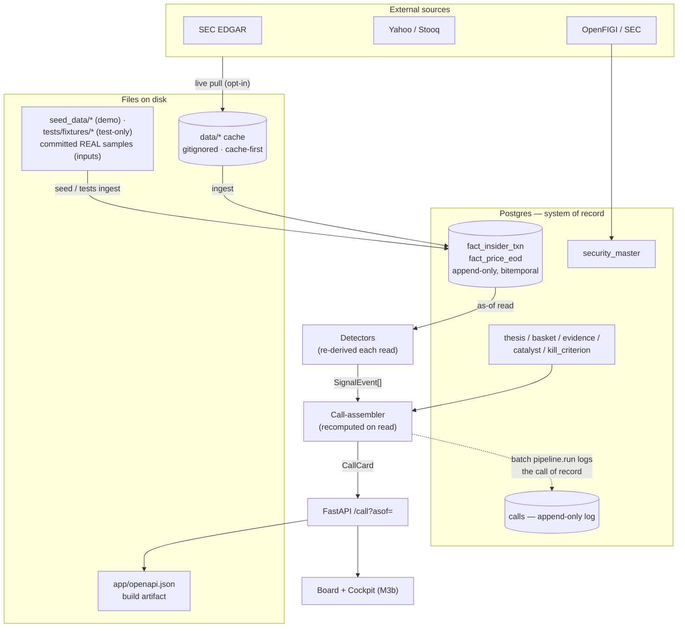

# Alpha Deck — Data Flow (where everything lives)

> An anti-black-box reference: what is a **file on disk** vs. what lives in the **database** vs. what is
> **recomputed on the fly**. Companion to [`PROJECT_OVERVIEW.md`](PROJECT_OVERVIEW.md) (the *why*) and
> [`CALL_LOGIC.md`](CALL_LOGIC.md) (how a call is made).

## The one rule

**At runtime, Postgres (the database) is the system of record.** Files on disk are only ever one of:

1. **Committed inputs** — real captured samples. The shared HIMS demo samples live in `backend/seed_data/` (read by `pipeline/seed.py` *and* the real-data tests); test-only samples live in `backend/tests/fixtures/`. Static; never written at runtime.
2. **A gitignored cache** of live API pulls (`data/`) — a local mirror so we respect rate limits and re-runs are reproducible. **Safe to delete** (it re-pulls on demand). Not the source of truth.
3. **Build artifacts** — `app/openapi.json` (the frontend's type source), produced on demand.

And the load-bearing choice that *makes* it auditable: **signals are never stored, and the call you're served is recomputed from the facts on every read** (the serve path writes nothing; the batch `pipeline.run` appends the call of record to the `calls` log for accountability, and that log is never read back to serve). There is no hidden "signals" layer that can drift — what you see is always the current facts run through the current code, with provenance attached.

## The pipeline

```
                       EXTERNAL SOURCES (the internet)
        SEC EDGAR (Form 4)   ·   Yahoo/Stooq (EOD)   ·   OpenFIGI/SEC (identity)
                       │  live pull — only when you ask (allow_live), polite + rate-limited
                       ▼
        ┌──────────────────────────────────────────────┐
        │  data/  — local CACHE (gitignored)            │  cache-first: read if present,
        │  edgar_cache/ price_cache/ figi_cache/ ...     │  else fetch ONCE and write here.
        └──────────────────────────────────────────────┘  A mirror, NOT the source of truth.
                       │ ingest                 ▲
                       │             committed REAL samples (INPUTS — never written at runtime)
                       │      backend/seed_data/ (HIMS demo) · tests/fixtures/ (test-only samples)
                       │                        │ ingest (seed + tests read these)
                       ▼                        ▼
        ╔══════════════════════════════════════════════════════════════╗
        ║  POSTGRES — the system of record (all runtime state is here)  ║
        ║  security_master · fact_insider_txn · fact_price_eod          ║  facts = append-only,
        ║  thesis / basket / evidence / catalyst / kill · calls (log)   ║  bitemporal (no overwrite)
        ╚══════════════════════════════════════════════════════════════╝
                       │ as-of read (no lookahead on either time axis)
                       ▼
        Detectors  ──►  SignalEvent[]        ◄── RE-DERIVED on every read; stored NOWHERE
                       │
                       ▼
        Call-assembler  ──►  CallCard        ◄── pure; recomputed on every read (serve path
                       │                         writes nothing; the batch pipeline.run appends
                       │                         the call of record to `calls`, never read back)
                       ▼
        FastAPI   /theses/{id}/call?asof=   ──►  Board + Cockpit  (M3b)
                       │
                       └─►  openapi.json (build artifact)  ──►  frontend TS types
```

Same as a flowchart (renders on GitHub):



## Where every piece of data lives

| Artifact | Kind | Location | Written when | In git? |
|---|---|---|---|---|
| Wells Form 4 + HIMS EOD (the demo seed) | real captured **input** | `backend/seed_data/` | once, by hand (committed) | **yes** |
| Sample EDGAR / FIGI / price fixtures (tests) | real captured **input** | `backend/tests/fixtures/` | once, by hand (committed) | **yes** |
| EDGAR / price / FIGI raw responses | **cache** of live pulls | `data/` | on a live fetch (cache-first) | no (gitignored) |
| `openapi.json` | build artifact | `backend/app/` | when you run `openapi_export` | no (generated) |
| Resolved securities | identity | **Postgres** `security_master` | on resolve / seed | n/a (DB) |
| Insider txns, EOD bars | bitemporal **facts** | **Postgres** `fact_*` | on ingest / seed | n/a (DB) |
| Thesis + basket/evidence/catalyst/kill | the spine | **Postgres** | on `upsert` / seed | n/a (DB) |
| Assembled calls | accountability **log** | **Postgres** `calls` | one row per batch `pipeline.run` (never on a `/call` GET) | n/a (DB) |
| `SignalEvent[]` | **recomputed** | nowhere — in memory | **every read** | n/a |
| `CallCard` | **recomputed** | in memory (a copy → `calls`) | **every read** | n/a |

## Your question, directly

- **The "HIMS files" are two committed real-data samples** — `seed_data/edgar/hims_wells_form4.xml` (the actual Wells Form 4) and `seed_data/prices/HIMS.yahoo.json` (real HIMS EOD) — read by both `pipeline/seed.py` and the real-data tests. They live outside the test tree so shipped code never depends on `tests/`, and they exist so the seed and tests run **deterministically and offline**. They are *inputs*, read-only at runtime.
- **At runtime, HIMS data lives in Postgres** (its `security_master` row, its `fact_*` rows, its `thesis` rows) — exactly like any other name would. Add another ticker and *its* facts + thesis land in the same tables; nothing about HIMS is special in storage.
- **Are files written each time?**
  - *Seeding / tests:* **no** — they read the committed fixtures and write to the **database**.
  - *Live pulls* (when you fetch a name from EDGAR/Yahoo): **yes, but only the `data/` cache** — one file per unique upstream request, cache-first, gitignored, deletable. It's a politeness/repro mirror, never the source of truth.
  - *Serving a call* (`/call?asof=`): **zero files and zero writes** — it reads the DB and recomputes; the `calls` log is written only by the batch `pipeline.run`.

## Read path vs. write path

- **Write (ingest):** sources → (cache) → `fact_*` tables. Append-only: a correction is a *new row* with a later `recorded_at`, never an overwrite. The thesis spine is upserted; evidence is append-only.
- **Read (serve a call):** `/theses/{id}/call?asof=` loads the thesis, **re-derives** the dated signals from the facts as-of that date, runs the assembler, and returns the `CallCard` — and **writes nothing** (a GET is safe/idempotent; a refetch or as-of scrub accretes no rows). The call of record is logged separately by the batch `pipeline.run`, and `calls` is **never read back to serve**. (The log *is* readable for accountability — `calls_repo.list_for_thesis` / `latest_for_thesis`, and the future Scoreboard.)

## Why this isn't a black box

- **Recompute-on-read.** Signals and the call are derived fresh from facts every time — no stale, hidden, mutable cache of "what the system thinks."
- **Provenance on everything.** Every fired trigger carries its source + the computation (the EDGAR filing link, the price/volume numbers). If we can't show the work, we don't surface the result.
- **Append-only, bitemporal facts.** You can always ask "what did we know, and when?" Corrections never rewrite history.
- **Deterministic, not model-sourced.** Triggers fire from code against data; the LLM (M4b) only writes the *explanation* prose and never invents a number or a signal.
- **No lookahead.** Reads are pinned to an `asof` (event time) and a `known_at` (transaction time), so a backtest can't peek at the future.
